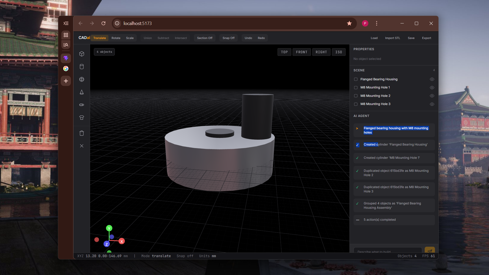
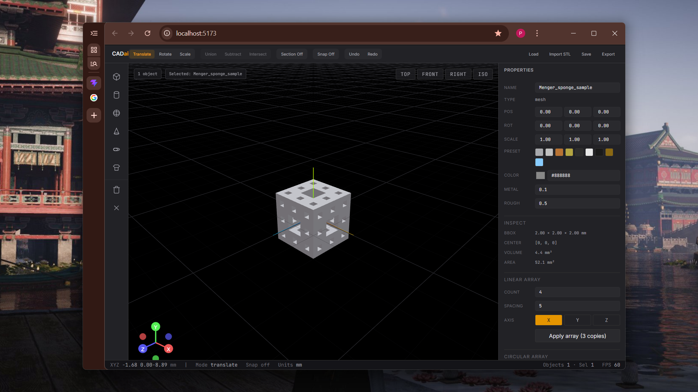

# CADai

CADai is a three-tier web application designed to integrate natural language AI interaction with a professional 3D computer-aided design (CAD) environment. The application features a React-based 3D frontend, a Python backend, and an AI agent layer.

The core philosophy of CADai is that the AI acts rather than converses. Users issue commands, and the AI agent executes geometric and scene modifications in real-time, displaying a stream of atomic actions rather than text explanations.

## System Architecture

The application is composed of three primary layers:

1. **Frontend (React + Vite + Three.js)**: Handles the 3D viewport, toolbar, property panels, and the AI agent action stream. Scene state is centrally managed using Zustand.
2. **Backend (FastAPI + Python)**: Exposes REST and WebSocket endpoints, manages project state, and routes agent requests.
3. **AI Agent Layer (Google ADK + Gemini)**: Processes user intent, determines a sequence of tool calls (e.g., create_shape, boolean_subtract), and executes them against the scene state.

## Core Features

*   **Real-time 3D Viewport**: Built on Three.js and React Three Fiber for declarative, high-performance rendering.
*   **Action-Driven AI Agent**: The AI responds to prompts by executing tool calls directly on the scene. The interface shows a log of completed actions (e.g., "Created cylinder", "Applied material") rather than conversational text.
*   **Atomic Tool Registry**: The agent interacts with the scene through a defined set of tools including scene modifications, boolean operations, and analysis functions.
*   **Centralized Scene State**: All changes flow through a single source of truth, enabling undo/redo functionality and parametric replay.

## Technology Stack

*   **Frontend**: React, Vite, Three.js, React Three Fiber, Zustand.
*   **Backend**: Python, FastAPI, Pydantic.
*   **AI**: Google Agent Development Kit (ADK), Google Gemini.
*   **Package Management**: uv (Python), npm (Frontend).

## Documentation

For deeper insights into the project design and architecture, refer to the `docs/` directory:
*   `architecture.md`: High-level system design.
*   `ai-agent-design.md`: Philosophy and technical details of the AI agent.
*   `tech-stack.md`: Detailed breakdown of the chosen technologies.

## Getting Started

Please refer to the individual `backend/README.md` and `frontend/README.md` files for setup and execution instructions.
